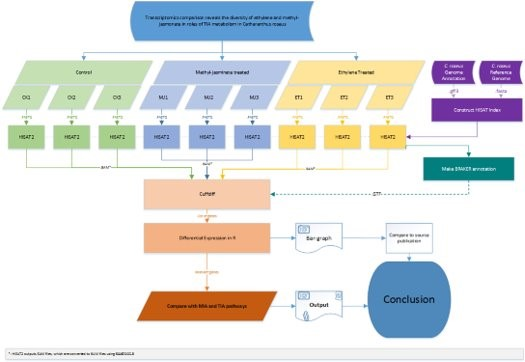

# TranscriptPipelineMIA
Pipeline for transcriptomic analysis of MIA regulation after methyl jasmonate and ethylene treatment in Catharanthus roseus

##Initial design
   
The initial design consisted of using all the available Fastq data from Pan et al, 2018. The available data would first be validated for their quality using FASTQC. The data would then be splitted into forward and reverse reads for all treatment groups. HISAT2 and samtools would then be used to map the reads to the reference transcriptome to create the BAM files. Stringtie would be used to create an improved annotated transcriptome with the BAM files and reference transcriptome. The improved transcriptome and the BAM files would eventually be used as the input in Cuffdiff for the identification of differentially expressed genes (DEGs) between the groups. However, this initial design leaded to various complications. First and foremost, the FASTQ data that was provided was not complete.  The 3 Fastq files for MJ consisted of 2 replicates of paired read data and 1 replicate of only forward read data. We decided to discard the single replicate of forward read data and continue with the 2 replicates from MJ, and the 3 replicates from ET and the 3 replicates from control. The new designed annotated transcriptome resulting from Stringtie lead to a very low number of DEGs in Cuffdiff that was consequently followed by awkward and incorrect results. To improve our pipeline, adjustments were made. First, instead of using both the forward and reverse reads, we only used the forward read. Second, Stringtie was completely discarded and the Cuffdiff analysis will use the reference transcriptome. Optionally, we decided to create an improved annotated reference transcriptome using Braker2 for implementation in Cuffdiff. The final pipeline is schematically displayed in Figure 1 and more elaborately explained in the sections below. 
   
##Data source and quality check
   
The data all originated from the publication of Pan et al., 2018 and were made public during the course [5]. C. roseus seedlings were treated with Hoagland’s solution containing methyl-jasmonate, ethylene or neither as control. After the treatment, RNA was extracted for transcriptome sequencing. Illumina HiSeq2000 performed the 100 nt pair-end sequencing. Low quality reads, adapter reads and reads with over 5% unknown reads were filtered out. The clean data consisted of 9 Fastq files. 2 replicates of paired read and 1 replicate of only forward read data of MJ treatment, 3 replicates of paired read data of ET treatment and 3 replicates of paired read data of control treatment. Using FastQC (version 0.11.6), the fastq files were assessed for their quality and were then parsed into fasta files containing only the IDs and sequence strings. Afterwards, the data was splitted in forward and reverse reads. Here, we continued with only the forward read data. 
   
##Read mapping
   
HISAT2 v2.0.5 was performed to map the forward reads to the provided reference genome from the paper of Kellner et al., 2015 [7]. HISAT2 was performed according to the protocol of Pertea et al with the parameters set on default for unpaired data [8]. An index file was created using HISAT2-build. The resulting outputs of SAM files were then converted to BAM files using samtools (v 0.1.19). Only the sorted SAM and BAM files were used in the progress. Furthermore, the output files of HISAT2 were validated using reference transcriptome and IGV v2.4 for proper mapping.
   
##Differential gene expression
   
Cuffdiff v2.2.1 was performed to determine the differential gene expression between the control, MJ and ET treated groups. Parameters as FDR and fold change were all set on default. Only the *_gene_exp.diff output file was used for further analysis.

##Result analysis and visualization
   
The output file from the last step (Cuffdiff) was analysed in R. Locus ID from the significant genes from the diff-file were annotated to the Locus ID in the reference transcriptome to determine their presence and/or role in the MIA pathway, respectively. Using the Monoterpenoid and indole alkaloid biosynthesis pathways from KEGG, we manually investigated the role of the detected MIA DEGs. All statistical graphs and plots were made in R using the packages ggplot and venndiagram, and were further prettified in photoshop. 

##Optional: Annotation improvement
   
The annotation of the provided reference genome was improved using Braker2 following pipeline B according to the user guide[9]. Braker2 was performed using the default settings with the exceptions of given paths of the tools, directories and files. Required input data were the reference genome fasta file and the sorted BAM files from the HISAT2 output. GeneMark-ET first trained the RNA-seq reads for ab initio gene predictions. A subset of the gene predictions of GeneMark-ET was then used to train Augustus (V 3.2.1) to predict the protein coding genes. The resulting gff-file output of Augustus was then used as the final reference annotation file.

   
   
   
Figure 1 Schematic overview of the final pipeline. Starting from the parsing and splitting of the reads, mapping of the transcript data with HISAT2, detection of significant expressed genes with Cuffdiff to the pairwise comparison analysis in R.
